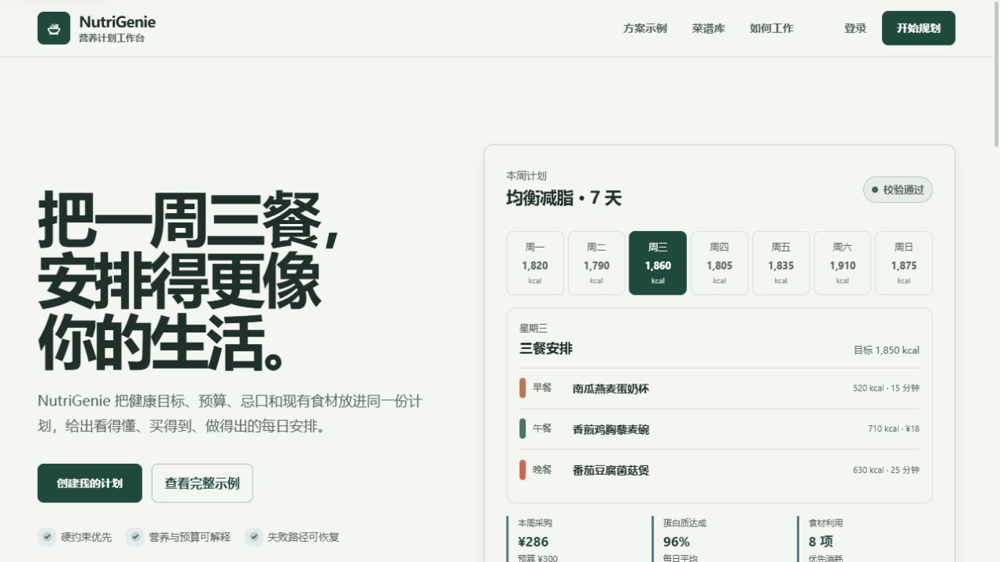
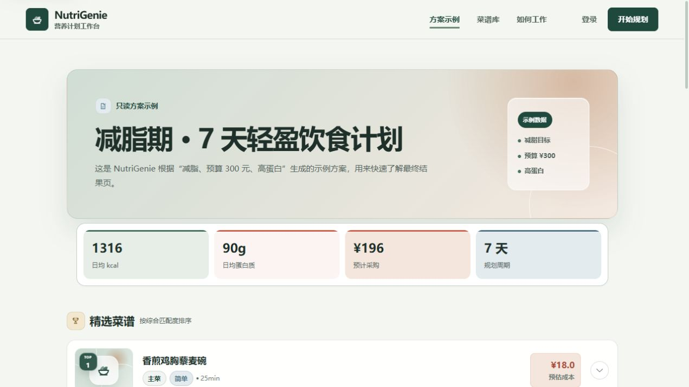

# NutriGenie

> AI Native 的个性化营养规划系统。

NutriGenie 是一个面向个人作品集的端到端 AI 应用 Demo。用户可以完善饮食画像，并用自然语言描述健康目标、预算、过敏原、忌口和家中库存；大模型负责生成菜谱、餐单、营养估算、预算估算和解释，程序负责硬约束校验、营养与预算汇总、版本持久化和安全边界。

项目的核心设计是 **AI Native + Deterministic Guardrails**：LLM 负责创作，程序负责验证。数据库不是最终菜谱候选池，RAG 仅作为可选参考上下文；没有数据库菜谱或 RAG 时，主流程仍然可以生成完整餐单。

> 当前项目定位为学习与作品集 Demo，不建议直接用于生产环境，也不构成医疗或营养治疗建议。

## 界面展示

### 首页



### 饮食计划结果页



## 功能概览

- 用户注册、登录和个人饮食画像管理
- 根据目标、饮食类型、预算、过敏原和库存生成 AI 原生个性化餐单
- 程序重新汇总食材营养和成本，不直接信任大模型总数
- 过敏原、忌口、饮食类型、结构完整性等硬约束校验与最多一次修复
- RAG 自动降级为可选参考上下文，不参与最终菜谱排名
- 异步生成计划，前端轮询展示处理进度
- 结果页支持自然语言修改和快捷操作
- 每次成功修改创建不可变版本，失败时保留上一个成功版本
- 生成每日计划、营养报告、采购清单和 AI 估算说明
- 管理员维护食材、菜谱和 RAG 知识文档
- 提供 RAG 检索评测与推荐效果对照脚本

## 系统架构

```text
Vue 3 + TypeScript
        │  REST API / 状态轮询
        ▼
FastAPI + LangGraph 工作流
        │
        ├─ 意图解析（初次生成）
        ├─ 约束分析（TDEE、预算、饮食类型、过敏原）
        ├─ 可选参考上下文（RAG）
        ├─ LLM Plan Generator（菜谱、餐单、估算）
        ├─ 硬约束校验与一次 LLM Repair
        ├─ 程序化营养与预算聚合
        └─ 不可变版本、消息和运行记录
        │                         │
        ▼                         ▼
MySQL：用户、画像、版本     Chroma：可选知识上下文索引
```

### 初次生成链路

```text
用户自然语言需求
  → 意图解析与约束编译
  → 可选 RAG 参考上下文
  → LLM 生成完整餐单
  → 程序校验 → 最多一次 LLM 修复
  → 程序聚合营养、预算和采购清单
  → 保存不可变版本
```

### 对话修改链路

```text
当前成功版本 + 用户指令
  → 保留原硬约束（明确修改健康目标、预算、饮食类型或忌口时重新解析）
  → 可选参考上下文
  → LLM 全量生成新版本
  → 程序校验、聚合并保存新版本
```

## 技术栈

| 层次 | 技术 |
| --- | --- |
| 前端 | Vue 3、TypeScript、Vite、Element Plus、Pinia、ECharts |
| 后端 | FastAPI、SQLAlchemy、Alembic、Pydantic |
| 工作流 | LangGraph、LangChain、确定性约束与聚合服务 |
| 数据库 | MySQL；测试使用 SQLite 内存数据库 |
| RAG | 可选 Chroma、Markdown 知识文档、Embedding |
| LLM | LangChain 结构化输出；用于意图解析、餐单生成和修复 |
| 任务执行 | 本地后台线程；知识库索引可选 RQ/Redis |

## 项目结构

```text
NutriGenie/
├─ backend/
│  ├─ app/
│  │  ├─ api/              # REST API 路由与请求模型
│  │  ├─ db/               # 数据库连接与种子数据
│  │  ├─ models/           # SQLAlchemy 数据模型
│  │  ├─ rag/              # 文档解析、Embedding、Chroma 检索与评测
│  │  ├─ services/         # 营养、成本、约束、推荐和安全服务
│  │  └─ workflow/         # LangGraph 工作流与提示词
│  ├─ knowledge_base/      # 菜谱 RAG 增强文档
│  ├─ scripts/             # 初始化、建索引、评测和管理员脚本
│  ├─ tests/               # 单元测试与集成测试
│  ├─ .env.example         # 环境变量模板
│  └─ requirements.txt
├─ frontend/
│  ├─ src/api/             # Axios API 封装
│  ├─ src/components/      # 通用、计划和菜谱组件
│  ├─ src/stores/          # Pinia 状态
│  ├─ src/views/           # 首页、画像、计划和管理页面
│  └─ package.json
├─ docs/                   # 产品、架构、API、RAG 和开发文档
├─ .gitignore
└─ README.md
```

## 本地运行

### 环境要求

- Python 3.11 或更高版本
- Node.js 20 或更高版本
- MySQL 8.0 或更高版本
- 可选：Redis，用于将知识库索引任务切换到 RQ 队列
- 可选：DeepSeek API Key 和智谱 Embedding API Key

### 1. 创建数据库

先创建一个空的 MySQL 数据库，名称需要与 `backend/.env` 中的 `DB_NAME` 保持一致。示例：

```sql
CREATE DATABASE nutrigenie
  CHARACTER SET utf8mb4
  COLLATE utf8mb4_unicode_ci;
```

### 2. 配置并启动后端

以下命令以 PowerShell 为例：

```powershell
cd backend
py -3.11 -m venv .venv
.\.venv\Scripts\Activate.ps1
python -m pip install --upgrade pip
python -m pip install -r requirements.txt
Copy-Item .env.example .env
```

编辑 `backend/.env`，至少确认以下配置：

| 变量 | 说明 |
| --- | --- |
| `DB_HOST` / `DB_PORT` | MySQL 地址和端口 |
| `DB_USER` / `DB_PASSWORD` | MySQL 登录信息 |
| `DB_NAME` | 数据库名称，默认 `nutrigenie` |
| `LLM_API_KEY` | DeepSeek Key；AI 原生餐单生成必须配置，意图解析可规则降级 |
| `PLAN_GENERATION_MODEL` | AI 餐单生成模型；默认使用 `LLM_MODEL` |
| `PLAN_GENERATION_TIMEOUT` | 餐单生成超时时间，默认 60 秒 |
| `EMBEDDING_API_KEY` | 智谱 Embedding Key；启用 RAG 建索引时需要 |
| `RAG_MODE` | `auto` 自动使用可用上下文，或设为 `off` |
| `RAG_CONTEXT_TOP_K` | 每次最多注入的参考内容数量，默认 5 |
| `JWT_SECRET_KEY` | JWT 签名密钥，部署时必须替换为随机高强度字符串 |
| `DEV_EMAIL_VERIFICATION_CODE` | 本地注册验证码，仅供开发演示 |
| `KNOWLEDGE_QUEUE_BACKEND` | 默认 `background`；使用 RQ 时设置为 `rq` |

初始化数据库和种子数据：

```powershell
python -m app.db.seed
```

生成菜谱知识文档并构建 Chroma 索引（已配置 `EMBEDDING_API_KEY` 时执行）：

```powershell
python scripts\generate_recipe_knowledge.py
python scripts\build_rag_index.py
```

启动 API 服务：

```powershell
python -m uvicorn app.main:app --reload --port 8000
```

后端接口文档：<http://localhost:8000/docs>

### 3. 启动前端

另开一个终端：

```powershell
cd frontend
npm ci
npm run dev
```

前端默认地址：<http://localhost:5173>

Vite 开发服务器会将 `/api` 请求代理到 `http://localhost:8000`。前端页面包含公开 Demo（`/demo`）、登录注册、画像、计划和管理员页面。

### 4. 创建管理员账号（可选）

在 `backend/.env` 中配置 `ADMIN_EMAIL`、`ADMIN_PASSWORD` 和可选的 `ADMIN_NICKNAME`，然后运行：

```powershell
cd backend
.\.venv\Scripts\Activate.ps1
python scripts\create_admin.py
```

管理员可以访问食材、菜谱和知识库管理页面。

## 测试与评测

运行不依赖真实 MySQL 的默认测试：

```powershell
cd backend
.\.venv\Scripts\Activate.ps1
python -m pytest tests -q
```

运行需要 MySQL 和种子数据的集成测试：

```powershell
python -m pytest tests -m integration -q
```

运行推荐效果对照评测：

```powershell
python scripts\evaluate_recommendation.py
```

评测输入位于 `backend/evaluation/cases.json`，报告默认生成到 `backend/evaluation/reports/`。一次本地评测快照（2026-08-01，30 条用例）如下：

| 指标 | 规则 Baseline | Hybrid RAG |
| --- | ---: | ---: |
| HitRate@5 | 83.33% | 83.33% |
| Precision@5 | 29.33% | 35.33% |
| 硬约束违规数 | 0 | 0 |

该结果用于展示当前 Demo 的评测方法，不代表所有数据集或生产场景的效果。建议使用评测脚本重新生成报告。

## 安全与开源发布检查

- 不要提交 `backend/.env`、任何 API Key、数据库密码、JWT 密钥或管理员密码。
- 只提交 `backend/.env.example`，并在真实环境中填写密钥。
- 生产环境必须关闭调试模式、替换 JWT 密钥、配置真实邮箱验证流程，并限制 CORS 来源。
- 不要将 API Key 放入前端代码或打包产物。
- `backend/data/chroma/`、`backend/evaluation/reports/`、Python 虚拟环境、`node_modules/` 和前端 `dist/` 都属于本地或生成文件，不应提交。
- 如果密钥曾经被提交、上传、截图或分享过，应先在对应平台撤销并重新生成，再公开仓库。

当前仓库中的食品、营养和菜谱内容主要用于作品集演示。正式使用前应替换为来源可验证、具备授权或合规依据的数据。

## 文档说明

项目中的个人笔记和开发过程文档不纳入公开仓库。公开版本以本 README、代码结构和接口文档为准。

## 项目限制

- 本项目是一般健康饮食参考工具，不提供疾病诊断、治疗或个体化医疗建议。
- 周计划采用启发式规划和结果校验，不保证全局最优，也不能替代专业营养师建议。
- 当前邮件验证码为本地开发演示机制，不适用于生产环境。
- RAG 索引依赖外部 Embedding 服务；未配置或不可用时自动降级为纯 LLM 生成。
- 第一版完整餐单最多 7 天；营养和成本明确标记为 AI 估算，不构成医学或财务精确结论。
- 生成菜谱不会自动写入公共 `recipes` 表，数据库菜谱仅保留为管理数据和可选参考资料。
- 当前任务执行以单进程本地后台线程为主，生产部署应替换为可靠的任务队列和持久化监控方案。

## 许可证

本项目目前尚未附带许可证。公开仓库前，请根据你的授权意愿补充 `LICENSE` 文件；未声明许可证不等于默认允许他人自由复制、修改或分发。
