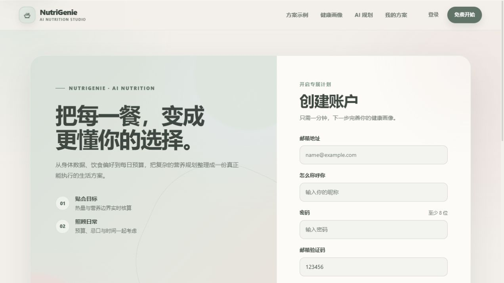

# NutriGenie

<p align="center">
  <a href="README.md">English</a> · <strong>简体中文</strong>
</p>

<div align="center">
  <p><strong>AI 驱动、程序校验的个性化营养规划系统</strong></p>
  <p>
    
    
    
    
    
  </p>
</div>

NutriGenie 根据用户的健康目标、身体信息、预算、饮食偏好、过敏原、忌口和现有食材生成个性化周餐单。大模型负责理解需求和创作候选菜品，确定性程序负责食材标准化、营养与成本核算、硬约束校验、整周排程和结果持久化。

> NutriGenie 提供一般性的饮食规划参考，不构成医疗诊断、治疗建议或专业营养处方。

## 界面预览

| 首页 | 计划工作台 |
| --- | --- |
|  |  |

### 登录与注册



## 核心功能

- **用户与饮食画像**：支持注册、登录，以及身体数据、活动水平、健康目标、饮食类型、预算、过敏原和忌口管理。
- **自然语言生成计划**：用户可以直接描述需求，系统将其解析为结构化约束并生成个性化餐单。
- **确定性事实核算**：所有食材映射到标准目录后重新计算营养和成本，不直接采用模型估算值。
- **硬约束校验与修复**：检查过敏原、忌口、饮食类型、食材可解析性和数据结构；失败时执行有限次数的定向修复。
- **整周计划优化**：控制菜品重复、相邻餐次重复和菜品多样性，并按目标校准可信食材份量。
- **持续调整与版本记录**：支持用自然语言修改现有方案；每次成功修改生成独立版本，失败不会覆盖上一个可用结果。
- **执行与采购管理**：提供今日餐次、完成状态、营养报告、预算汇总和按食材聚合的采购清单。
- **后台管理**：管理员可维护标准食材、营养数据和菜谱内容。
- **响应式与无障碍体验**：适配桌面端和移动端，支持键盘导航、清晰焦点、200% 缩放重排和减少动态效果偏好。

## 工作原理

```text
用户画像 + 自然语言需求
           │
           ▼
    意图解析与约束编译
           │
           ▼
     大模型创作候选菜品
           │
           ▼
 食材标准化、营养与成本重算
           │
           ▼
  硬约束校验与有限定向修复
           │
           ▼
 整周优化、份量校准与最终校验
           │
           ▼
营养报告、采购清单与不可变版本
```

系统遵循“模型负责创作，程序负责验证”的原则。模型输出必须经过标准食材目录和确定性校验链路后才能成为最终计划，校验失败且无法修复时会明确返回失败，不会静默保存不合格结果。

## 技术栈

| 层次 | 技术 |
| --- | --- |
| 前端 | Vue 3、TypeScript、Vite、Element Plus、Pinia、ECharts |
| 后端 | FastAPI、SQLAlchemy、Alembic、Pydantic |
| AI 工作流 | LangGraph、LangChain、结构化模型输出 |
| 数据库 | MySQL；本地快速体验可使用 SQLite |
| 认证 | JWT、Argon2 密码哈希、基于角色的管理员权限 |
| 测试 | Pytest、Node.js Test Runner、Vue Type Check、Vite Build |

## 项目结构

```text
NutriGenie/
├─ backend/
│  ├─ alembic/             # 数据库迁移
│  ├─ app/
│  │  ├─ api/              # REST API 与请求/响应模型
│  │  ├─ db/               # 数据库连接、验证与种子数据
│  │  ├─ models/           # SQLAlchemy 数据模型
│  │  ├─ services/         # 营养、成本、约束和计划服务
│  │  ├─ tasks/            # 计划生成任务
│  │  └─ workflow/         # LangGraph 工作流与提示词
│  ├─ scripts/             # 初始化、管理员和验收脚本
│  ├─ tests/               # 单元测试与集成测试
│  ├─ .env.example         # 后端环境变量模板
│  └─ requirements.txt
├─ frontend/
│  ├─ public/              # 静态资源
│  ├─ src/
│  │  ├─ api/              # API 请求封装
│  │  ├─ components/       # 通用、布局、菜谱和计划组件
│  │  ├─ repositories/     # 本地状态持久化
│  │  ├─ router/           # 页面路由与访问守卫
│  │  ├─ stores/           # Pinia 状态管理
│  │  └─ views/            # 业务页面
│  ├─ tests/               # 前端契约测试
│  └─ package.json
├─ screenshots/            # README 界面截图
├─ README.md               # English
└─ README.zh-CN.md         # 简体中文
```

## 快速开始

### 环境要求

- Python 3.11 或更高版本
- Node.js 20 或更高版本
- MySQL 8.0 或更高版本；仅本地快速体验时也可使用 SQLite
- 可用的 DeepSeek API Key

### 1. 配置后端

以下命令以 PowerShell 为例：

```powershell
cd backend
py -3.11 -m venv .venv
.\.venv\Scripts\Activate.ps1
python -m pip install --upgrade pip
python -m pip install -r requirements.txt
Copy-Item .env.example .env
```

编辑 `backend/.env`。使用 SQLite 快速启动时，至少配置：

```dotenv
DATABASE_URL_OVERRIDE=sqlite:///./data/nutrigenie.db
LLM_API_KEY=your-deepseek-api-key
JWT_SECRET_KEY=replace-with-a-long-random-secret
DEV_EMAIL_VERIFICATION_CODE=123456
```

使用 MySQL 时，保持 `DATABASE_URL_OVERRIDE` 为空，并配置以下变量：

```dotenv
DB_HOST=localhost
DB_PORT=3306
DB_USER=root
DB_PASSWORD=your-password
DB_NAME=nutrigenie
```

先创建对应数据库：

```sql
CREATE DATABASE nutrigenie
  CHARACTER SET utf8mb4
  COLLATE utf8mb4_unicode_ci;
```

### 2. 初始化并启动 API

```powershell
cd backend
.\.venv\Scripts\Activate.ps1
alembic upgrade heads
python -m app.db.seed
python -m uvicorn app.main:app --reload --port 8000
```

启动后可访问：

- API：<http://localhost:8000>
- Swagger 文档：<http://localhost:8000/docs>

### 3. 启动前端

另开一个终端：

```powershell
cd frontend
npm ci
npm run dev
```

前端默认运行在 <http://localhost:5173>，开发服务器会将 `/api` 请求代理到 <http://localhost:8000>。

### 4. 创建管理员账号（可选）

在 `backend/.env` 中填写：

```dotenv
ADMIN_EMAIL=admin@example.com
ADMIN_PASSWORD=replace-with-a-strong-password
ADMIN_NICKNAME=管理员
```

然后运行：

```powershell
cd backend
.\.venv\Scripts\Activate.ps1
python -m scripts.create_admin
```

## 测试

### 后端测试

运行默认测试集：

```powershell
cd backend
.\.venv\Scripts\Activate.ps1
python -m pytest tests -q
```

运行需要 MySQL 的集成测试：

```powershell
python -m pytest tests -m integration -q
```

使用真实模型和 MySQL 验证完整餐单生成链路：

```powershell
python scripts\smoke_ai_native_v2.py --synthetic --timeout 480
```

该验收脚本只使用合成画像，并在结束后清理本次创建的临时记录。

### 前端测试

```powershell
cd frontend
npm test
npm run build
```

## 安全说明

- 不要提交 `backend/.env`、API Key、数据库密码、JWT 密钥或管理员密码。
- 部署前必须使用高强度随机 JWT 密钥，并替换本地验证码机制。
- API Key 只能保存在后端环境变量中，不应出现在前端代码或构建产物中。
- 面向公网部署时，应关闭调试模式、限制 CORS 来源，并为 API、数据库和任务执行配置监控与访问控制。
- 食品营养和价格数据会受到品牌、产地、烹饪损耗及地区差异影响，生成结果应结合实际情况复核。

## 贡献

欢迎通过 Issue 提交问题或改进建议。提交代码前请确保：

1. 变更范围清晰，并包含必要的测试。
2. 后端测试、前端测试和生产构建均通过。
3. 提交内容不包含密钥、真实用户数据或本地生成文件。

## 许可证

本仓库目前未附带开源许可证。未经授权，不代表可以自由复制、修改或分发项目代码。
