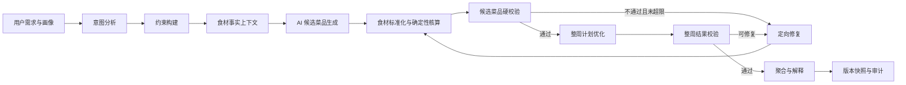

# NutriGenie AI Native 推荐系统 V2 重构规划

> 文档状态：实施基线  
> 编写日期：2026-08-24  
> 适用范围：餐单生成、菜品生成、营养与成本核算、约束校验、整周优化、版本快照及结果展示

## 1. 重构背景

NutriGenie 的产品定位是 AI Native。系统不应从固定菜谱库中挑选一个近似答案，而应针对用户当次需求即时创作菜品，并将生成、校验、修复、组合和解释组织成一个完整的智能工作流。

当前 V1 已经具备以下基础能力：

- 大模型可以生成结构化菜谱、餐次和总结；
- LangGraph 已串联意图、约束、生成、校验、聚合与版本保存；
- 方案结果以不可变版本快照保存，支持对话式修改和历史恢复；
- RAG 只作为可选上下文，不再直接从固定菜谱库选择结果；
- 前端可以展示 AI 生成菜谱、生成进度和版本历史。

但 V1 仍有四个根本缺口：

1. 食材营养和价格由大模型自行估算，后端只是把模型给出的数字相加；
2. 周计划主要接受大模型直接给出的餐次安排，缺少确定性的多样性优化器；
3. 未识别食材、重复菜品、预算超限和热量偏差多数只是警告，不能可靠阻断不合格方案；
4. 生成、标准化、硬校验、修复和周计划优化没有清晰分层，失败原因和可观测性不足。

因此 V2 的目标不是推翻 V1，而是在现有 AI Native 原型上建立可信的“AI 创作 + 程序验证”闭环。

## 2. 产品承诺

NutriGenie V2 的核心承诺是：

> NutriGenie 不从固定菜谱库中挑选答案，而是根据每位用户的目标、预算、忌口和生活方式即时设计菜品，再由程序依据食材事实进行核算、校验和整周组合。

这意味着：

- AI 拥有菜名、食材组合、做法、风味、场景和推荐理由的创作权；
- 数据库不决定“推荐哪道已有菜”，只提供食材、营养、价格、单位和风险事实；
- 后端不信任 AI 给出的营养与成本数字，必须重新计算；
- 过敏、饮食类型、食材可解析性、餐次完整性和重复上限是硬约束；
- 不合格方案必须进入有上限的修复循环，超过上限则明确失败，不偷偷回退到固定菜谱；
- 最终结果必须可解释、可追溯、可恢复。

## 3. 设计原则

### 3.1 AI 负责创作，程序负责事实

AI 输出候选菜谱的创意结构：名称、适用餐次、食材名称和数量、步骤、菜系、难度及理由。营养、价格、过敏关系和单位换算由程序根据食材目录计算。

### 3.2 数据库是事实层，不是答案层

数据库可以保存：

- 用户画像、偏好和反馈；
- 标准食材、别名、计量单位和换算关系；
- 每 100g 营养数据、价格基准和食材分类；
- 过敏原与饮食类型禁用关系；
- AI 生成方案的不可变快照、模型信息、提示词版本和校验报告。

数据库中的旧菜谱只允许用于演示或故障隔离，不参与默认推荐链路。

### 3.3 硬约束优先于体验降级

过敏原命中、食材无法解析、餐次缺失、引用错误和饮食类型冲突必须阻断结果。热量、蛋白质、预算和多样性按照明确阈值区分硬错误与软提醒。

### 3.4 每次生成都有证据

每个版本需要记录：模型、提示词版本、食材目录版本、生成耗时、修复次数、校验结果、多样性指标、RAG 使用情况和失败原因。

### 3.5 失败必须可见

LLM 不可用、结构化输出失败、修复次数耗尽或食材覆盖不足时，系统返回可重试错误。默认路径不得静默切回数据库菜谱。

## 4. 目标架构



## 5. LangGraph 工作流设计

V2 使用十个逻辑节点，前端合并显示为九个用户可理解阶段。

| 顺序 | 节点 | 职责 | 失败处理 |
|---|---|---|---|
| 1 | `intent_analyzer` | 识别目标、偏好、忌口、餐数和自然语言约束 | 规则解析可降级 |
| 2 | `constraint_builder` | 合并画像、显式输入和系统边界 | 缺少关键画像时阻断 |
| 3 | `ingredient_context` | 构建允许使用的标准食材事实快照 | 目录为空时阻断 |
| 4 | `ai_candidate_generator` | AI 生成足量候选菜品，不决定最终周计划 | 结构错误进入重试 |
| 5 | `recipe_normalizer` | 解析食材别名与单位，重新计算营养和成本 | 未解析食材进入修复 |
| 6 | `candidate_validator` | 检查过敏、饮食类型、步骤、份量和事实一致性 | 最多修复两次 |
| 7 | `weekly_optimizer` | 确定性组合整周餐次，控制重复与目标偏差 | 候选不足时进入修复 |
| 8 | `plan_validator` | 校验整周热量、预算、完整性和多样性 | 可修复则回到修复节点 |
| 9 | `plan_aggregator` | 生成周计划、营养报告、采购清单和说明 | 聚合失败则阻断 |
| 10 | `snapshot_writer` | 保存不可变版本、审计元数据和对话消息 | 事务回滚并可重试 |

修复循环统一受 `PLAN_REPAIR_MAX_ATTEMPTS` 控制，V2 默认值为 2。禁止无上限循环。

## 6. 数据契约

### 6.1 AI 候选菜品输入

大模型只能输出创意数据，不再要求输出可信营养数字：

```json
{
  "name": "柠香鸡胸藜麦碗",
  "meal_slots": ["lunch", "dinner"],
  "category": "main_dish",
  "cuisine_type": "融合家常",
  "difficulty": "easy",
  "prep_time_min": 10,
  "cook_time_min": 20,
  "servings": 1,
  "ingredients": [
    {"name": "鸡胸肉", "quantity": 150, "unit": "g", "optional": false},
    {"name": "柠檬", "quantity": 0.5, "unit": "个", "optional": false}
  ],
  "steps": ["处理食材", "完成烹饪"],
  "generation_note": "高蛋白且适合工作日晚餐"
}
```

为了兼容已有模型返回，V2 可以接收 `nutrition_estimate` 和 `cost_estimate`，但只把它们保存为 `declared_*` 审计字段，不参与最终计算。

### 6.2 标准化食材

标准化后的每个食材行项目必须包含：

- `ingredient_id`：事实目录主键；
- `catalog_name`：标准名称；
- `input_name`：AI 原始名称；
- `quantity` / `unit`：原始用量；
- `estimated_grams`：统一换算后的克数；
- `nutrition`：按克数重新计算的营养；
- `estimated_cost`：按价格基准重新计算的成本；
- `resolution_source`：`exact`、`alias` 或 `normalized`；
- `data_source`：固定为 `ingredient_catalog_v1`。

### 6.3 最终结果

最终方案 schema 升级为 `ai_native_v2`，保持 V1 前端字段兼容，并新增：

- `generation_meta.ingredient_catalog_version`；
- `generation_meta.candidate_count`；
- `generation_meta.unique_recipe_count`；
- `generation_meta.max_recipe_repeat`；
- `generation_meta.unresolved_ingredients`；
- `generation_meta.nutrition_source = ingredient_catalog_v1`；
- `generation_meta.cost_source = ingredient_catalog_v1`；
- `validation.quality_metrics`。

## 7. 食材事实层

### 7.1 数据来源

V2 首期复用现有 `ingredients` 和 `ingredient_nutrition` 表：

- `ingredients.unit` 与 `unit_price` 作为价格基准；
- `ingredient_nutrition.*_per_100g` 作为营养基准；
- `ingredients.category` 用于单位换算和采购分类；
- 内置别名表解决“西红柿/番茄”等常见同义表达。

后续可将别名迁移到独立 `ingredient_aliases` 表，但不阻塞 V2 首期上线。

### 7.2 单位换算

营养计算：

```text
estimated_grams = quantity × unit_to_gram(unit, category)
nutrition = nutrition_per_100g × estimated_grams / 100
```

成本计算：

```text
base_unit_grams = unit_to_gram(catalog_unit, category)
estimated_cost = unit_price × estimated_grams / base_unit_grams
```

无法换算的单位不能按 1g 静默处理，必须标记 `unit_unresolved` 并进入修复。

### 7.3 目录约束

生成提示词提供标准食材白名单。AI 可以自由组合这些食材形成新菜，但不能凭空创造目录外食材。这样既保留生成多样性，又保证事实可计算。

## 8. 约束等级

| 约束 | 等级 | V2 行为 |
|---|---|---|
| 过敏原、明确忌口 | 硬约束 | 命中即失败并修复 |
| vegan / gluten_free / keto 禁用食材 | 硬约束 | 命中即失败并修复 |
| 未解析食材或单位 | 硬约束 | 禁止进入最终结果 |
| 每日必需餐次缺失或重复 | 硬约束 | 禁止进入最终结果 |
| 同一道菜超过 2 次 | 硬约束 | 优化器不得产生 |
| 相邻餐次完全相同 | 硬约束 | 优化器不得产生 |
| 整周唯一菜品少于 `max(餐次数 × 2/3, 规划天数 × 2)` | 硬约束 | 候选不足则修复 |
| 日均热量偏离目标超过 15% | 可修复约束 | 优先重组，仍失败则修复 |
| 超预算超过 10% | 可修复约束 | 优先重组，仍失败则修复 |
| 蛋白质低于目标 85% | 可修复约束 | 优先重组，仍失败则提示 |
| 烹饪时间、菜系偏好 | 软约束 | 进入优化评分和提醒 |

## 9. 候选生成策略

### 9.1 数量

候选目标数量：

```text
candidate_target = clamp(餐次数 + 6, 12, 32)
```

7 天三餐的默认目标为 27 道候选菜品，最终至少使用 14 道不同菜品。

### 9.2 餐次覆盖

候选按餐次分组生成：

- 早餐不少于总候选的 25%；
- 午餐不少于 30%；
- 晚餐不少于 30%；
- 其余可以跨餐次复用；
- 每道候选必须声明 `meal_slots`。

### 9.3 提示词规则

提示词必须包含：

- 标准食材名称白名单；
- 明确禁止食材和饮食类型；
- 候选数量和餐次覆盖要求；
- 每道菜 2-10 个主要食材；
- 单道菜最多出现两次；
- 不输出医疗承诺；
- 不要求模型凑营养和价格数字。

## 10. 整周优化器

优化器是确定性代码，不调用 LLM。它按日和餐次逐个选择候选菜品。

### 10.1 硬筛选

- 食材已经全部解析；
- 候选支持当前餐次；
- 当前使用次数小于 2；
- 不与上一个餐次重复；
- 不违反过敏和饮食类型约束。

### 10.2 评分函数

```text
score =
  0.35 × 热量目标匹配
  0.20 × 蛋白质目标匹配
  0.15 × 剩余预算匹配
  0.15 × 菜系多样性
  0.10 × 主蛋白多样性
  0.05 × 烹饪时间偏好
  - 重复惩罚
```

优化器使用稳定排序和确定性 tie-break，保证同一候选集能重现相同方案，便于测试和审计。

### 10.3 目标分配

默认餐次热量比例：早餐 25%、午餐 40%、晚餐 35%。若用户选择两餐或包含加餐，则按餐次集合重新分配。

## 11. 修复循环

修复不是让模型“重新随便生成一次”，而是提供结构化反馈：

- 错误代码和路径；
- 未解析食材及可替代标准食材；
- 缺少的餐次候选数量；
- 重复次数和唯一菜品缺口；
- 热量、预算和蛋白质偏差；
- 要求保留已经通过校验的候选。

修复温度低于首次生成，默认最多 2 次。每次修复后必须重新执行标准化、候选校验和整周优化，禁止只修改校验报告。

## 12. 版本、审计与幂等

继续使用现有：

- `meal_plan_runs`：一次生成或编辑任务；
- `meal_plan_versions`：不可变结果快照；
- `meal_plan_messages`：用户与 AI 的修改记录；
- `client_request_id`：编辑请求幂等键。

每个 V2 版本应记录：

- 模型名与提示词版本 `ai_native_v2`；
- 食材目录版本或摘要；
- 候选数、唯一菜品数、最大重复次数；
- 修复次数和每轮错误摘要；
- 营养与成本数据来源；
- RAG 来源与失败信息；
- 节点耗时和总耗时。

## 13. API 与兼容策略

现有 API 路径保持不变：

- `POST /plans`；
- `GET /plans/{id}/status`；
- `GET /plans/{id}`；
- `POST /plans/{id}/messages`；
- `POST /plans/{id}/retry`；
- 版本列表和恢复接口。

兼容原则：

- V2 继续输出 `recipes`、`weekly_plan`、`nutrition_report`、`shopping_list`、`validation`、`generation_meta` 和 `summary`；
- `recipe_key` 继续作为生成菜品的稳定引用；
- 前端根据 `schema_version` 显示数据来源；
- 已保存的 V1 版本仍可读取和恢复；
- 新生成结果默认写入 `ai_native_v2`。

## 14. 前端调整

### 14.1 生成进度

显示九个用户阶段：

1. 意图分析；
2. 约束构建；
3. 食材知识；
4. AI 创作候选；
5. 食材标准化；
6. 硬约束校验；
7. 整周优化；
8. 结果校验与汇总；
9. 保存版本。

### 14.2 结果可信度

结果页应明确展示：

- “菜品由 AI 即时生成”；
- “营养与价格由食材目录重新核算”；
- 方案唯一菜品数、最大重复次数和校验状态；
- 无法解析或修复失败时展示具体原因，不展示半成品方案。

### 14.3 对话编辑

修改方案时保留上一成功版本。新版本生成失败时，旧版本继续可用，并显示本轮失败原因。

## 15. 配置项

新增或调整：

| 配置 | 默认值 | 说明 |
|---|---:|---|
| `PLAN_PROMPT_VERSION` | `ai_native_v2` | 生成提示词版本 |
| `PLAN_REPAIR_MAX_ATTEMPTS` | `2` | 最大修复次数 |
| `PLAN_CANDIDATE_MIN` | `12` | 最少候选数量 |
| `PLAN_CANDIDATE_MAX` | `32` | 最多候选数量 |
| `PLAN_MAX_RECIPE_REPEAT` | `2` | 同菜最大出现次数 |
| `PLAN_MIN_UNIQUE_RATIO` | `0.67` | 最低唯一菜品比例 |
| `PLAN_CALORIE_TOLERANCE` | `0.15` | 日均热量允许偏差 |
| `PLAN_BUDGET_TOLERANCE` | `0.10` | 预算允许偏差 |

## 16. 可观测性

每次运行输出结构化日志：

- `plan_id`、`run_id`、`version_id`；
- 当前节点和节点耗时；
- LLM 模型、请求次数和修复次数；
- 候选数、解析成功率、唯一菜品数和最大重复次数；
- 日均热量偏差、预算偏差和硬错误数；
- 最终状态和失败错误码。

日志不得记录 API Key、完整用户隐私画像或未脱敏的敏感健康信息。

## 17. 测试策略

### 17.1 单元测试

- 精确名称、别名和未知食材解析；
- 重量、体积和计数单位换算；
- 基于每 100g 数据重新计算营养；
- 基于价格单位重新计算成本；
- 过敏原和饮食类型硬拦截；
- 优化器最大重复两次；
- 相邻餐次不重复；
- 唯一菜品比例达标；
- 修复次数上限；
- V1 快照读取兼容。

### 17.2 集成测试

- 模拟 LLM 返回候选 → 标准化 → 校验 → 优化 → 聚合；
- 首轮含未知食材，第二轮修复成功；
- 修复两次仍失败，任务正确进入 failed；
- 编辑失败时旧版本仍可读取；
- 状态 API 能观察到真实节点推进。

### 17.3 前端验收

- 生产构建通过；
- 九步进度与后端节点对应；
- V1/V2 结果均可展示；
- V2 显示确定性核算来源；
- 失败、重试、编辑和版本恢复路径可操作。

## 18. 验收指标

7 天三餐方案必须满足：

- AI 生成来源占比：100%；
- 固定菜谱库推荐调用次数：0；
- 21 个餐次完整率：100%；
- 唯一菜品不少于 14 道；
- 同一道菜最多出现 2 次；
- 相邻餐次重复数：0；
- 未解析食材数：0；
- 过敏原硬冲突数：0；
- 营养与价格事实来源覆盖率：100%；
- 日均热量落入目标 ±15%，或给出明确无法满足原因；
- 总预算不超过目标 10%，或给出明确无法满足原因；
- 修复次数不超过 2；
- 生成 P95 目标小于 45 秒，超时必须可重试。

## 19. 实施批次

### 批次 A：事实层与契约

- 调整 AI 生成 schema，使营养和价格声明变为可选审计字段；
- 新增食材目录快照、别名解析和严格单位换算；
- 新增确定性营养与价格计算；
- 补齐事实层单元测试。

### 批次 B：候选、校验与优化

- 修改提示词为候选生成模式；
- 新增标准化节点；
- 强化未解析食材、过敏、重复和完整性硬校验；
- 新增确定性周计划优化器；
- 将优化失败反馈给修复循环。

### 批次 C：工作流与审计

- 重排 LangGraph 节点和条件边；
- 扩展 WorkflowState；
- 保存 V2 元数据和质量指标；
- 保持对话编辑、幂等与版本恢复兼容。

### 批次 D：前端与验收

- 更新九步进度和动态文案；
- 展示核算来源和多样性指标；
- 执行完整后端测试、前端构建与端到端冒烟。

## 20. 预计文件变更

后端核心：

- `app/services/ai_plan_models.py`；
- `app/services/ingredient_catalog.py`（新增）；
- `app/services/ai_plan_generator.py`；
- `app/services/plan_validator.py`；
- `app/services/weekly_plan_optimizer.py`（新增）；
- `app/services/plan_aggregator.py`；
- `app/workflow/nodes/ai_native_nodes.py`；
- `app/workflow/graph.py`；
- `app/workflow/state.py`；
- `app/tasks/plan_task.py`；
- `app/config.py` 与 `.env.example`；
- 对应测试文件。

前端核心：

- `src/types/index.ts`；
- `src/components/plan/ProgressStepper.vue`；
- `src/views/PlanResultPage.vue`。

## 21. 风险与控制

| 风险 | 影响 | 控制方式 |
|---|---|---|
| 食材目录只有有限覆盖 | AI 候选频繁无法解析 | 提示词白名单、别名解析、覆盖率监控 |
| 结构化输出过大 | 延迟或截断 | 候选上限 32、限制食材和步骤数量 |
| 目标互相冲突 | 无法同时满足预算与营养 | 明确优先级并返回可解释失败 |
| LLM 修复破坏已通过菜品 | 修复结果不稳定 | 反馈要求保留合法候选，重新全量校验 |
| 价格数据为零或过期 | 预算核算失真 | 标记价格覆盖率，零价格产生提醒 |
| V1 历史结果字段不同 | 恢复页面报错 | schema_version 分支与兼容类型 |

## 22. 完成定义

只有同时满足以下条件，V2 才视为完成：

1. 默认推荐链路不查询固定菜谱用于选择结果；
2. AI 输出的每个食材都能映射到事实目录；
3. 最终营养和成本全部由后端重新计算；
4. 周计划由确定性优化器产生并满足重复上限；
5. 硬约束失败能进入最多两轮修复并留下记录；
6. 结果以 `ai_native_v2` 快照保存，V1 历史仍可读取；
7. 后端完整测试和前端生产构建通过；
8. 关键验收指标有自动化测试或可重复的验证脚本。

